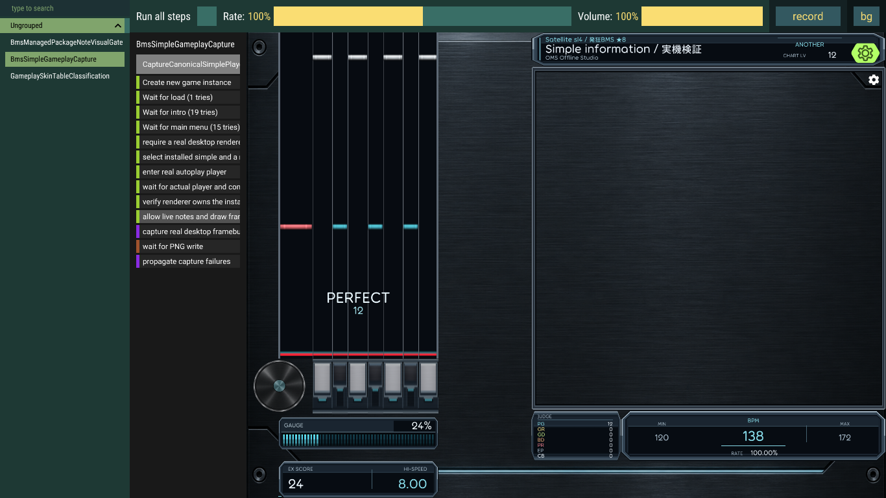

# OMS 皮肤制作手册

OMS 皮肤可以改变 **BMS 与 osu!mania 的游玩画面**：音符、长条、轨道、键帽、判定、血槽、实时信息、背景装饰，以及原生 BMS 的 BGA 窗口。先替换图片和配色，再学习布局、动画和实时绑定；需要记住近期击打等组合逻辑时，才使用可选数值脚本。普通作者不需要编译游戏或编写 DLL。

本文参考 [osu! 皮肤制作入口](https://osu.ppy.sh/wiki/zh/Skinning)按“元素、设置、指南、常见问题”组织。OMS 只提供下面已实现的能力；上游的菜单、其它玩法或历史元素列表不是 OMS 支持清单。现有选歌页、菜单、结果页不能用本手册的场景替换。

| 从哪里开始 | 内容 |
| --- | --- |
| [第一次制作](START_HERE.md) | 从静线复制，改名字/配色，检查、导入、刷新 |
| [按画面元素查文件](#3-按画面元素查找文件) | 实际位置、素材、尺寸起点、动画与注意事项 |
| [布局和玩法差异](#5-布局与-bmsmania-差异) | 轨宽、键盘、HUD、BGA、多舞台 |
| [场景动画与信息](#6-从图片到动画和实时信息) | 节点、轨迹、绑定、状态机、变体、模板 |
| [完整进阶例子](#7-可以直接验证的完整例子) | First Scene 与 Reference Study，附效果和操作步骤 |
| [格式与上限](#8-格式资源与运行上限) | 文件、图片、节点、动画、文字、脚本预算 |
| [排错与发布](#9-常见问题刷新与发布) | 为什么没生效、如何更新、需要实际检查什么 |

## 1. 选择合适的制作方法

| 目标 | 改什么 | 是否需要额外脚本授权 |
| --- | --- | --- |
| 换颜色、音符、键帽、背景与音效 | PNG/WAV、`skin.ini`；模板配色可用 `author.json` | 否 |
| 改轨宽、舞台比例、键盘区、BGA位置 | 对应 `[Bms]` / `[Mania]` 配置 | 否 |
| 旋转、渐变、换图、遮罩、实时分数/血量 | JSON 声明式场景 | 否 |
| 根据最近数次击打、随机种子、多个数值组合演出 | `oms-script 1` 数值脚本 | 是，玩家可拒绝或撤销 |
| 拖动已有可编辑组件、改属性和图片 | 游戏原组件布局编辑器，保存独立副本 | 否；该编辑器不直接编辑完整 scene/script |

皮肤只改变表现：不能改输入、判定、计分、音符到达时刻、谱面键音、BGA内容或播放时钟。脚本不是 Lua/JavaScript，不运行系统程序。新作品从[静线作者源](../sources/oms-simple/)复制最方便；静线也是缺失必要部件时的默认外观。

## 2. 皮肤包结构

```text
my-skin/
  skin.ini                       名称、作者、玩法素材和布局
  bms/*.png                      BMS素材（目录名可自定）
  mania/*.png                    mania素材
  normal-hitnormal.wav           普通mania音效示例
  gameplay-skin.json             可选：场景清单
  gameplay-skin.scene.json       使用场景时必需：完整场景
  gameplay-skin.script           可选：数值脚本源码
  scene/white.png                清单引用的图片
  author.json                    仅制作工具的生成配方，游戏不要求
```

`.osk` 是分享用的普通皮肤包，根目录必须能找到 `skin.ini`，不是 `my-skin/my-skin/skin.ini`。日常修改可把完整目录放进设置 → 皮肤 → “打开皮肤文件夹”所打开的 `chartskin/`，然后“刷新皮肤”；分享时用作者工具打包。旧版已登记的外部目录只读保留，当前设置不再提供新注册入口。

名称和作者在 `[General]` 中写 `Name:`、`Author:`，模板使用 `Version: 2.7`。场景与脚本有自己的版本头，不要把它们改成 `2.7`。一份包可以同时支持两种玩法；玩家在设置中分别选择 BMS 与 osu!mania 的作品。

## 3. 按画面元素查找文件

下图是**静线的原样游戏截图**（2026-09-13，合成7K，保留测试边栏，无BGA媒体），用来辨认位置，不表示本轮重新拍摄或所有尺寸都已验收。右上是曲目资料，右中是BGA区域，右下是判定统计/BPM，左侧为落键区、控制台和血槽。



另有[素材拼合预览](../dist/oms-simple-preview.png)，它是作者工具绘制的示意图，**不是游戏截图**。原始PNG均可在[静线源目录](../sources/oms-simple/)查看。下表的尺寸是当前真实文件的宽×高，适合作为修改起点，不是引擎要求或所有皮肤的统一推荐尺寸。

| 玩家看到的元素 | 静线实际素材 / 起始尺寸 | 配置或公开部件 | 动画、缩放与定位 |
| --- | --- | --- | --- |
| 普通短音符 | `bms/note-white.png`、`note-accent.png`；128×24；mania同类也为128×24 | `NoteImage{lane}` / `object.note` | 支持连续编号帧；按车道宽度显示，过多透明边会使可见音符显得细窄 |
| 长条头与尾 | `head-white.png`、`tail-white.png`；128×24 | `NoteImage{lane}H/T` / `object.long-note.head/tail` | 各自独立图或编号帧；尾部可显式关闭，头不能关闭 |
| 长条身体 | `body-white.png`；128×128 | `NoteImage{lane}L` / `object.long-note.body` | 身体随真实长条长度显示，BMS相对宽度由 `LongNoteBodyWidth` 控制；不要在整张身体图上画一个固定时长的完整长条 |
| 白键/黑键/转盘轨道底色 | `bms/lane-white.png` 等；256×32 | `playfield.lane-surface` | 铺在车道区域，底色与音符应有足够对比；分隔线单独画 |
| 轨道分隔、小节线、判定线 | `bms/divider.png`、`bar.png`、`target.png`；后两者256×32 | `playfield.lane-divider/bar-line/judgement-line/hit-target` | 厚度和位置由真实布局处理；皮肤不能平移实际判定时刻 |
| 键帽松开/按下 | `bms/key-white.png` 128×128、`pressed-white.png` 128×72；mania键图128×72 | `KeyImage{lane}`、`KeyImage{lane}D` / `playfield.key` | 两张图片响应真实按键；应保留相同视觉中心，避免按下时跳动 |
| 转盘控制图 | `bms/scratch-platter.png`；1254×1254 | BMS `KeyImageS`，独立键区配 `ScratchKeyWidth` | 正方形画布适合圆盘；独立键区按原图比例居中。装饰转盘/光束另有 `playfield.turntable/laser` |
| 命中闪光 | `bms/explosion.png`；256×256；`flash.png` | `effect.hit-explosion/key-flash` | 真实输入/命中控制生存期；scene可改表现，可选项可关闭 |
| 地雷 | `bms/mine.png`；128×256 | `object.mine` | 原生BMS适用；mania无此对象表现。不要用长条尾图替代地雷 |
| 判定、连击 | `bms/hud.png` 与场景中的文字节点 | `hud.judgement/combo` | 可绑定等级/连击或用变体换图；不是一张名叫PERFECT的图就会自动生效 |
| 血槽 | `bms/gauge.png`；1024×96 | `hud.gauge` | 纯图片以全长暗槽加从左揭露的亮层显示；scene用 `gauge.value` 绑定，分段格距不应随血量压缩 |
| 曲名、分数、BPM、统计、进度 | 场景文字；`scene/white.png`可画条形 | `hud.text` 和只读 bindings | 每项直接读游戏事实，无需脚本；长曲名可用 `text-overflow: ellipsis` |
| 舞台背景、边框、底板 | `scene/cabinet.png` 1536×1024，`bms/frame.png`、`plate.png` | `stage.background/foreground`、`playfield.backdrop/baseplate` | 可用公共素材或scene；不要用老的 `Stage*` 字段猜BMS支持情况 |
| SUDDEN+/HIDDEN+/LIFT遮挡区 | `bms/cover.png` | `playfield.lane-cover.fill/decoration` | 皮肤画填充和装饰，游戏控制真实遮挡/位移；必要填充不能关闭 |
| BGA画面与外框 | `bms/bga-frame.png`；1024×768 | `bga.viewport/frame`、`BgaViewports` | 仅原生BMS；框是皮肤图片，画面来自谱面，共享同一播放内容 |

尺寸更大不自动更清晰：显示宽度由轨道/窗口决定，内存按解码像素计算。先保留模板尺寸确认效果，再扩大；阴影和辉光可先烘焙进PNG，避免把大面积模糊加在每颗音符上。

## 4. 图片、编号帧与 skin.ini

### 图片与音效

作者工具和范例以 **PNG** 为图片格式；需要透明度时保留 alpha。素材基名在 INI 中不带扩展名，例如 `bms/note-white`；scene清单路径则必须带扩展名，例如 `scene/white.png`。游戏部分旧素材读取兼容JPG和`@2x`，但当前作者工具的素材存在性检查以 `.png` / `-0.png` 为准，新作品优先使用这条可检查路径。

原生BMS短键/长条编号帧从 `name-0.png` 连续到 `name-N.png`，固定60帧/秒。例如2帧循环约33.3ms，60帧约1秒。存在首帧时优先用序列；编号中断会结束此前连续序列，后面的文件不会自动补进来。缺少 `-0` 不会从 `-1` 开始。统一尺寸、透明边和对齐点，避免每帧跳动；普通静态图仍可用 `name.png`。

mania普通音符/长条的已准备编号帧也沿现有60帧路径；旧版灯光/爆炸等专用元素可能使用自己的帧长，不能将 `AnimationFramerate` 当作所有OMS部件的统一开关。要准确控制一组装饰的帧时长，使用scene的 `frame` 轨迹。

普通mania击打音可替换根目录的 `normal/soft/drum-hitnormal/hitclap/hitfinish/hitwhistle.wav`；这是组合命名，例如 `normal-hitnormal.wav`。长条持续音的 `sliderslide/sliderwhistle` 是否触发由谱面决定。BMS及BMS转谱键音由原谱资源和游戏控制，不用皮肤WAV覆盖。替换声音后在实际音量、暂停和长条中试听。

### 基础分块

`[Mania]` 用 `Keys: 4` 等分块，`NoteImage0` 从0起；`[Bms]` 用 `Keymode: 5K/7K/9K/9K_PMS/14K` 分块，普通键和皿按模板的 `1…`、`S` / `S2` 映射。旧 `[Mania] Keys:9` 的0～8兼容编号与BMS公共轨道的1～9不是同一层，修改时保留模板映射。

下面是**配置片段**，放进已有对应块，不能只保存它就当完整皮肤：

```ini
[Bms]
Keymode: 7K
LongNoteBodyWidth: 0.60
NoteImage1: bms/my-note
NoteImage1H: bms/my-head
NoteImage1L: bms/my-body
NoteImage1T: bms/my-tail
```

模板同时有公共资源声明。**同一部件的公共 `Provide` 优先于旧 `NoteImage*`**：只改兼容字段可能看不到变化。换现有同名PNG最直接；换文件名时在文本编辑器中查找旧基名，将需要的公共声明与兼容声明一起调整。

### 自己提供、继承、关闭

按[部件目录](CATALOG.md)的所属目录选择 section：通用部件（包括 `bga.viewport/frame`）放在 `[GameplaySkin.Common:1]`；仅 BMS 扩展部件才放在 `[GameplaySkin.Bms:1]`。只想应用于 BMS 时，在 `Target` 写 `ruleset=bms`，不能据此把通用部件搬到 Bms section。先写完整 `Target`，再写资源行。所有token区分大小写；图片基名用双引号。下面是一个独立的**片段**，演示共用HUD：

```ini
[GameplaySkin.Common:1]
Target: Global ruleset=any keymode=any stage-mode=any
hud.text: resource Provide "scene/white"
```

`Provide` 使用自己的素材；`Inherit` 继续找可用的下层部件；`Suppress` 明确关闭允许关闭的可选部件。必要音符、长条头身、车道、判定线等不接受 `Suppress`；可关闭项目见[部件目录](CATALOG.md)。不能用空字符串或损坏图片表示“关闭”。

精确玩法、键数、样式和轨道目标优先于更宽的声明；精确声明无效时会回落到下一来源，不改选同包更宽的候选。跨5K/7K四样式时用 `presentation=p1/p2/center-p1/center-p2` 区分索引。`Target` 不是CSS选择器，稳定ID与全部索引必须对应真实布局；完整形式见[字段参考](REFERENCE.md#真实车道布局与-ini)。

## 5. 布局与 BMS/mania 差异

### BMS键区和信息区

在要修改的每个 `[Bms] Keymode` 块中声明；尺寸相对游戏提供的安全区域。以下是实际接受范围，不是建议全部取上限。

| 字段 | 值与作用 |
| --- | --- |
| `PlayfieldWidth / PlayfieldHeight` | 0.15～0.95 / 0.45～0.94；落键区宽高比例 |
| `NormalLaneWidth / BlackLaneWidth / ScratchLaneWidth` | 0.25～4的相对宽度权重；黑键宽只用于5K/7K/14K每侧2/4/6键，9K不应用 |
| `NormalLaneSpacing / ScratchLaneSpacing` | 0～2的相对间隔权重 |
| `KeyAreaHeight` | 0～0.18；判定线下独立控制区，默认0 |
| `ScratchKeyWidth` | 1～4；独立控制区的皿图宽度倍率，不改变皿音轨 |
| `GaugeHeight` | 0.02～0.12，默认0.036；血槽区域高度 |
| `BgaInformationHeight` | 0～0.30，默认0；大于0才提供曲名、判定、速度及玩家信息区域 |
| `LongNoteBodyWidth` | 大于0且不超过1，长条身相对车道宽 |
| `HitTargetHeight / HitTargetBarHeight / HitTargetLineHeight` | 区域1～128，条/线0.5～区域高度；是布局尺寸，不能更改实际判定偏移 |
| `HitTargetGlowRadius / BarLineHeight` | 0～96 / 0.5～32 |

空间不足时布局会同时处理键区、血条和信息区的避让，不能把一个比例当作最终像素保证。非法字段会有诊断并使用该字段的确定默认值。`HitTargetVerticalOffset` 不是公开INI字段。实际默认值和更多说明见[参考](REFERENCE.md#真实车道布局与-ini)。

mania沿对应 `[Mania] Keys` 块的 `ColumnWidth`、`ColumnSpacing`、`HitPosition` 等兼容设置；数组项数须匹配该块。不能把它们复制进 `[Bms]` 期待生效。当前原生mania谱面的产品入口最高18K；内部目录上限或模板组合不等于20K谱面可用。

### BGA窗口与内容

原生BMS可以声明自己的窗口数量、位置、比例和画面适配方式；BMS转mania仍使用mania表现，**没有转谱BGA**。BGA素材、切换、叠层、POOR与时钟都来自谱面，引擎播放同一份内容，多个窗只是不同显示方式。

新字段放进对应 `[Bms]` 块，下面是7K的1P样式片段：

```ini
[Bms]
Keymode: 7K
PlayfieldWidth: 0.25
BgaViewports: 0.70,0.10,0.25,0.25,fit; 0.72,0.50,0.20,0.15,fill
```

每组依次为 `x,y,width,height,mode`，坐标/尺寸均相对安全区域；用分号分隔，最多16窗，顺序对应scene的BGA索引。`fit` 保留完整画面并允许留边，`fill` 居中放大裁切，`stretch` 拉伸到矩形。这里适配的是谱面叠层合成后的4:3画布；没有时间线的静态背景按图片自然比例处理。宽屏窗口不等于重写谱面合成坐标。

`x/y` 非负，`width/height` 必须大于0，右边和底边不得越过1；数字用小数点，mode严格用小写。`BgaViewports: none` 显式关闭。窗口与轨道、键区、血槽或信息区冲突时整组不显示，不会挪位、减窗或改成默认布局；为1P写的右侧窗口可能不适用于2P，必须换样式、窄屏实际检查。

`check` 可拒绝语法、数值范围和数量超限，但不能离线确认某个屏幕和样式下是否撞上键区。进入游戏后，在日志目录的 `runtime.log` 搜索 `bms.layout.bga-viewports-unavailable` 可定位整组无空间；当前设置没有专属布局错误面板。

不写此字段时保留原来的自动布局：`BgaWidth/BgaHeight` 为0.01～1的最大区域，`BgaVerticalPosition` 为0～1，自动保持4:3并避让；14K旧默认四窗保留。`BgaInformationHeight` 独立控制信息带：即使 `none` 或窗口无空间，只要它大于0，曲名/判定/BPM/玩家信息区域仍保留；等于0才不发布这些区域。此时原生BMS的BGA专属场景装饰也不显示，但语法、素材和所属部件仍须合法；这不是让mania接受BGA节点的开关。完整可打包例子见[BGA Layout](examples/bga-layout/README.md)。

### 哪些部件不能跨玩法照搬

| 项目 | 原生BMS | mania（含BMS转谱） |
| --- | --- | --- |
| 音符、长条、键帽、轨道、HUD、装饰 | 支持 | 支持 |
| 地雷、装饰转盘、皿光束 | 按BMS键型适用；9K无转盘/皿光束 | 不适用 |
| BGA窗口/框/内容状态 | 支持 | 不适用 |
| 白/黑轨宽比例、独立转盘控制区 | BMS字段 | 使用mania自身列布局 |
| 判定统计名 | perfect/great/good/meh/miss/ok对应PG/GR/GD/BD/PR/空POOR | 保持mania六档含义，不把ok叫空POOR |
| 多舞台/换皿侧 | 按keymode和presentation | 按single/dual及实际列数 |

场景没有“这个目标不存在就忽略”通用开关。跨玩法先用global共用信息；玩法专属节点可通过同包**素材匹配模板**挂载，不要把BGA节点直接放入必须供mania加载的共同根树。

## 6. 从图片到动画和实时信息

scene包含固定字段 `contract/root/tracks/stateMachines/bindings/templates/instances`；不用的数组写 `[]`，`variants` 可省略。节点必填 `id/type/target/blend/properties/effects/children`；类型为 `container/sprite/text/mask/clip`。完整结构从[First Scene](examples/first-scene/gameplay-skin.scene.json)复制，不把本节片段当整文件。

可见节点须属于本包自己 `Provide` 的公开部件。在所有者节点写 `slot`，孩子沿用；分派不同部件的外层根容器应为空属性、无资源/效果、`blend: inherit`。`Inherit` 不会同时继承默认包的scene供自己修改。

| 机制 | 适合做什么 | 不能当作什么 |
| --- | --- | --- |
| 节点属性 | 坐标、大小、颜色、透明度、锚点、混合、文字与遮罩 | 任意引擎对象属性 |
| `tween` 轨迹 | 按毫秒关键帧旋转、缩放、移动、渐变 | wall-clock动画或判定时序修改 |
| `frame` 轨迹 | 在清单已声明图片间切换 | 任意GIF/视频解码器 |
| `bindings` | 将当前分数、血量、BPM等映射到属性 | 公式、字符串拼接或历史累计语言 |
| `stateMachines` | 当前运行、输入、对象或判定状态的表现 | 任意连续历史事件状态机；暂停时即时更新的界面（整个游玩场景冻结） |
| `variants` | 根据对象状态、判定等级、BGA状态选择资源 | 任意表达式或文件路径计算 |
| `templates / instances` | 复用节点树，按同包的已选素材生成舞台实例 | 无上限动态创建、任意参数函数 |
| 可选脚本 | 将多个数值和有限历史组合成数值表现 | 文字、图片路径、网络、游戏规则脚本 |

### 坐标、属性与效果

`target` 可为global、带精确id/index的stage/group/lane、hud、bga。`x/y/width/height` 是相对区域比例，父容器变换继续作用于孩子；不是固定屏幕像素。锚点/原点有九宫格值，`z` 只能调整所在层中的顺序。布局与单位完整表见[属性参考](REFERENCE.md#节点目标和属性)。

数字范围：`x/y` 为-4～4；width/height为0～4；scale为0～8；rotation为±36000度；opacity/reveal-x为0～1；font-size为1～128。颜色用 `#RRGGBB` 或 `#RRGGBBAA`。混合有inherit/alpha/additive/multiply/screen；效果为blur/glow/outline/shadow。大面积效果和很多音符clone一起占预算，不能只按源JSON节点数估计成本。

### 常用绑定

下面是 `bindings` 数组中的**一项**，`lesson.score` 来自完整例子：

```json
{ "id": "lesson.bind.score", "target": "lesson.score", "property": "text", "source": "score.value" }
```

| 读取内容 | source | 值与显示 |
| --- | --- | --- |
| 得分、准确率、连击、血量 | `score.value`、`score.accuracy`、`combo.value`、`gauge.value` | 准确率/血量0～1；准确率text显示两位小数百分比 |
| 谱面进度 | `timing.progress` | 0～1；首物件前0，末物件后1，零时长0；text显示整数百分比 |
| 拍、小节、当前/最低/最高BPM | `timing.beat/measure/bpm/bpm-min/bpm-max` | 真实音乐时间线，STOP不伪装成低BPM |
| 已选滚速 | `scroll.speed` | 当前玩法设置数值，不是统一物理单位或绿数 |
| 曲目信息 | `song.title/artist/difficulty/level/table-classification` | 字符串，表名等级与作者标级分开；每项最多256个UTF-16单元 |
| 累计判定、断连 | `judgement.count.perfect/great/good/ok/meh/miss`、`combo.breaks` | 从真实计分器读取，跳转与重试正确恢复 |
| 当前判定 | `judgement.result/offset` | 等级字符串/偏差毫秒；没有当前判定时为miss/0，不代表新发生一次Miss |
| 轨道输入、当前对象 | `input.pressed`、`object.state` | 布尔值/状态字符串，作用于对应目标 |
| BGA | `bga.content-state` | empty/ready/playing/paused/failed，只在适用玩法使用 |

字符串只写text；布尔值可写visible/text；数值可写受支持的数值属性或text。资源换图用variants。`format: percent/fixed-2/uppercase` 与 `text-overflow: ellipsis` 是文字的静态格式选择，不写进绑定公式。

做进度条时固定父容器宽度，把0～1绑定到孩子的width；不要用 `scale-x=0` 表达完全隐藏，底层极小缩放可能留下细线。分段血槽可用clip的 `reveal-x`，暗槽和外框放在clip之外。

### 状态、动画与模板

轨迹每项必填id/type/target/property/easing/loop/keyframes；帧为id/time/value，时间必须严格递增。easing为step/linear/in/out/in-out；循环周期由最后帧决定。2秒一周的完整写法在 `lesson.turn`，修改最后帧2000即可调整。

状态机事件为 `gameplay.attach/loaded/start/pause/complete/fail`、`input.key.down/up`、`object.spawn/state`、`judgement.hit`、`timing.stop`、`bga.state`。`gameplay.resume` 不是合法作者事件；恢复、跳转和重试从完整当前状态重建。`judgement.hit` 表示存在当前判定，也包括真实Miss。要累计“最近N次”，使用脚本事件而非不断读取绑定中的miss。

variants仅接受 `object.state / judgement.result / bga.content-state` 作为来源，必须给default与至少一条case；图片均引用清单资源id。模板实例在`target`和`material`中二选一；素材匹配可按Global/Stage的同包Provide部件和精确资源名挂载，未匹配时不生成，但模板语法/资源仍要合法。完整例子与全部字段见[参考](REFERENCE.md#动画状态机绑定变体模板)。

## 7. 可以直接验证的完整例子

先做[First Scene](examples/first-scene/README.md)：它是可以直接检查和打包的独立小包，只用一张白色PNG，展示分数绑定、进度、运行状态、循环旋转和可选血量缩放。README列出每个node id、预期效果、修改练习和一个应被拒绝的坏字段。

再做[Reference Study](examples/reference-study/README.md)：先复制完整静线，再覆盖三个完整文件，保留音符等全部基础素材。它增加判定换图、模板实例、最近击打与血量的组合，分别展示“当前事实”和“有限历史”。不要直接把只有三个文件的目录打成皮肤，也不要用`generate`覆盖已经手写的练习。

脚本并非这些效果的前提：旋转、分数、进度和状态无需授权。只有额外组合缩放请求权限，拒绝后仍应保持基本游玩与必要信息。语言、完整程序、编译与预算见[脚本指南](SCRIPTING.md)。

## 8. 格式、资源与运行上限

这些数字是**拒绝超限输入的硬上限，不是性能目标**。同一包可能同时受文件、解码、模板展开和运行实例预算约束。比如128×128×4×120帧约7.5MiB解码内存，不是压缩PNG总大小；一个带glow的音符树在密谱中会复制很多次。

| 面 | 实际上限 |
| --- | --- |
| 作者工具整目录 | 128MiB、4096普通文件，不接受链接 |
| `skin.ini` / 名称与作者 | 1MiB；各256字符、无控制字符 |
| manifest / scene JSON / JSON深度 | 64KiB / 512KiB / 32 |
| scene资源 | 256项；单资源16MiB、合计64MiB；单图16×1024²像素、合计64×1024²像素；解码合计256MiB |
| BMS音符编号帧专用上限 | 每组件256帧；单边8192、单帧16×1024²像素；组件解码64MiB、包解码256MiB；声明帧4096、唯一纹理2048。作者工具的更小整包上限仍适用 |
| scene源节点 / 树深 / 每节点孩子 | 2048 / 16 / 128 |
| 模板 / 实例 / 展开节点 | 128 / 1024 / 8192 |
| 轨迹 / 每轨帧 / 总关键帧 / 时间 | 512 / 512 / 8192 / 最长86400000ms |
| 状态机 / 状态 / 赋值 / 转移 | 128 / 1024 / 4096 / 2048 |
| 绑定 / 变体 / 每变体case / 总case | 512 / 512 / 32 / 4096 |
| 单节点效果 / 源效果 / 运行效果 | 8 / 512 / 8192；运行节点32768 |
| 运行文字 | 总字形8192、像素64×1024²、字节256MiB；动态文字通常每节点预留384字形，曲目元数据256、判定计数10 |
| 运行效果表面 | 128×1024²像素、512MiB |
| 每帧属性应用 / 每事件状态赋值 / 每帧创建 | 16384 / 8192 / 256 |
| 脚本源码 / 字节码 / 行 / 编译指令 | 64KiB / 256KiB / 4096 / 2048 |
| 脚本state / heap / requests / targets | 128 / 512 / 32 / 128 |
| 脚本单回调指令 / 每帧指令 / 每帧set | 4096 / 16384 / 256；每帧最多追赶120个60Hz tick |

JSON拒绝未知/重复字段与重复id，数字必须有限，id使用稳定ASCII名字；精确字符限制、属性、效果表面和专用实例预算见[完整参考](REFERENCE.md#预算和错误定位)。scene/script固定文件名，不接受自定义加载路径。资源只能引用包内相对路径，不能写绝对路径、`..`或链接。

## 9. 常见问题、刷新与发布

| 现象 | 先检查 |
| --- | --- |
| 换图后没变 | 是否改了当前玩法/键数；公共Provide是否仍指旧图；是否选了正确皮肤并退出游玩后刷新 |
| `generate`后手写文件没了 | 生成配方重写了文件；以后手写后直接check/pack，保留源版本备份 |
| 只有第一帧或动画提前结束 | 是否从0编号、文件名/尺寸一致；是否中间缺帧；该元素是否有专用帧长 |
| `OMS-SKIN-CODEC-021` | 当前玩法、样式、stable id与全部索引不匹配；不能靠另一条正确声明掩盖 |
| scene未知字段/资源/绑定 | 004未知字段、013未知资源、018未知绑定；检查拼写与manifest资源id |
| scene当前玩法不支持 | 027；不要在mania共同根上放BGA/地雷/皿专用节点 |
| BGA窗不见 | 先check排除语法、越界和超16窗；确认未写none且谱面有BGA；进游戏后在runtime.log搜索bms.layout.bga-viewports-unavailable，再调整当前样式下的窗口 |
| 脚本没有效果 | 两项/多项required是否全部允许；包修改后是否重新授权；只写权限不会带来时间回调 |
| 脚本报错但游戏仍能玩 | 可选脚本被停止；按错误码/源行号修复循环、越界、非有限值或预算超限，基础场景继续显示 |
| check通过，实际进入失败或效果错位 | CLI不拥有当前谱面、窗口、样式和活跃音符池；按具体玩法检查准备诊断及实际布局 |

更新流程为 **改源文件 → check → 退出游玩/预览 → 刷新固定目录**；分享流程为 **check → pack/import → 选择新版本 → 实际检查**。`update`也是普通导入，不会覆盖旧游戏记录。当前重载失败保留旧画面；没有自动watcher或游玩中reload。

正式分享前至少查看：目标键数与单双舞台、BMS四种单侧样式、最窄窗口、短键/长条/皿/地雷、低血量与长曲名、暂停/恢复/重试、脚本拒绝/授权/撤销。导出后再普通导入一次，确认没有依赖作者目录外的文件。`check`或局部截图不能代替实际可读性和听感检查。

查看运行诊断：在设置中搜索“日志”或“logs”，点击“导出日志 / Export logs”，完成后点通知打开 `compressed-logs.zip`，解压后查看 `runtime.log`。BGA 布局冲突搜索 `bms.layout.bga-viewports-unavailable`；CLI 报的文件、行号与稳定代码用于修复源文件。无需注册外部目录或编译客户端。

## 技术参考与验证记录

本手册描述作者可用的文件与操作。逐字段以[普通作者参考](REFERENCE.md)、[公共目录](CATALOG.md)和[脚本指南](SCRIPTING.md)为查表入口；完整使用步骤不依赖源码仓库。维护者附加资料在仓库`doc_md/subline/P1-A/`：技术约束、兼容与恢复历史、软件验证、未完成的设备/视觉验收。现有只读谱面视觉兼容保留，但没有新的beatmap-local scene/script作者格式；作品请用普通皮肤包或固定目录。
